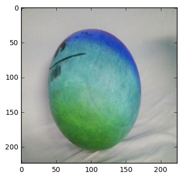

# Deep Learning

### 1. Introduction

    Deep learning is impacting everything from healthcare to transportation to manufacturing, and more. Companies are turning to deep learning to solve hard problems, like speech recognition, object recognition, and machine translation.

### 2. What is deep learning:
    
    sub-domain of AI, Broadly speaking, deep learning is a more approachable name for an artificial neural network. The “deep” in deep learning refers to the depth of the network. An artificial neural network can be very shallow.

    Neural networks are inspired by the structure of the cerebral cortex. At the basic level is the perceptron, the mathematical representation of a biological neuron. Like in the cerebral cortex, there can be several layers of interconnected perceptrons.


2. Transfer Learning


Deep learning plays a great role in computer vision and speech recognition.we will present deep learning demo here:

- demo include, webcam tutorial
- face model


```python
from keras.applications.resnet50 import ResNet50
from keras.preprocessing import image
from keras.applications.resnet50 import preprocess_input, decode_predictions
import numpy as np
```

    Using TensorFlow backend.
    


```python
import matplotlib.pyplot as plt
```


```python
# reterive weights of ResNet, that is trained on imageNet data
model = ResNet50(weights='imagenet')
```


```python
import cv2
```


```python
cap = cv2.VideoCapture(0)
i = 0
while(True):
    # Capture frame-by-frame
    ret, frame = cap.read()

    # Our operations on the frame come here
    gray = cv2.cvtColor(frame, cv2.COLOR_BGR2GRAY)

    # Display the resulting frame
    cv2.imshow('frame',gray)
    if cv2.waitKey(1) & 0xFF == ord('q'):
        break
    i +=1
    
    if(i>100):
        break
```


```python
# When everything done, release the capture
cap.release()
cv2.destroyAllWindows()
```


```python
# print(frame.shape)

# plt.imshow(frame)
# plt.show()
```


```python
frame = cv2.resize(frame, (224, 224))
```


```python
plt.imshow(frame)
plt.show()
```





```python
frame = frame.astype(float)
```


```python
# assign frame to x
x=frame

x = np.expand_dims(x, axis=0)
x = preprocess_input(x)
```


```python
preds = model.predict(x)
# decode the results into a list of tuples (class, description, probability)
# (one such list for each sample in the batch)
print('Predicted:', decode_predictions(preds, top=3)[0])
```

    Predicted: [('n09229709', 'bubble', 0.44652376), ('n02782093', 'balloon', 0.077246182), ('n04562935', 'water_tower', 0.025803359)]
    


```python

```


```python

```


```python
from keras.applications.inception_v3 import InceptionV3
from keras.preprocessing import image
from keras.models import Model
from keras.layers import Dense, GlobalAveragePooling2D
from keras import backend as K

```


```python
# create the base pre-trained model
base_model = InceptionV3(weights='imagenet', include_top=False)
```


```python
x = base_model.output
x = GlobalAveragePooling2D()(x)
# let's add a fully-connected layer
x = Dense(1024, activation='relu')(x)
# and a logistic layer -- let's say we have 9 class
predictions = Dense(9, activation='softmax')(x)
```


```python
# this is the model we will train
model = Model(inputs=base_model.input, outputs=predictions)
```


```python
# first: train only the top layers (which were randomly initialized)
# i.e. freeze all convolutional InceptionV3 layers
for layer in base_model.layers:
    layer.trainable = False
```


```python
# compile the model (should be done *after* setting layers to non-trainable)
model.compile(optimizer='rmsprop', loss='categorical_crossentropy')
```

## prepare data for model input


```python
from keras.preprocessing.image import ImageDataGenerator
import numpy as np
```


```python
batch_size = 16

# this is the augmentation configuration we will use for training
train_datagen = ImageDataGenerator(
        rescale=1./255,
        shear_range=0.2,
        zoom_range=0.2,
        horizontal_flip=True)
```


```python
train_generator = train_datagen.flow_from_directory(
        'F:/abuzar/data/raw_data',  # this is the target directory
        target_size=(224, 224),  # all images will be resized to 150x150
        batch_size=batch_size)
```

    Found 65 images belonging to 9 classes.
    


```python
#### The model is trained and saved to local directory

model.fit_generator(train_generator, epochs=1, steps_per_epoch=20)

```

    Epoch 1/1
    20/20 [==============================] - 112s - loss: 6.1721   
    


    <keras.callbacks.History at 0x1e229275e48>


```python
model.save_weights('F:/abuzar/py_code/model_weight.h5')
```

## Get prediction with new model


```python
# Image Preprocessing
img_path = 'F:/abuzar/data/raw_data/Hamza/5.jpg'
img = image.load_img(img_path, target_size=(224, 224))
x = image.img_to_array(img)
x = np.expand_dims(x, axis=0)
x = preprocess_input(x)
```


```python

```


```python
model = model.load_weights('F:/abuzar/py_code/model_weight.h5')
```


```python
preds = model.predict(x)
```


    ---------------------------------------------------------------------------

    AttributeError                            Traceback (most recent call last)

    <ipython-input-77-12291b6cb263> in <module>()
    ----> 1 preds = model.predict(x)
    

    AttributeError: 'NoneType' object has no attribute 'predict'


```python

```
